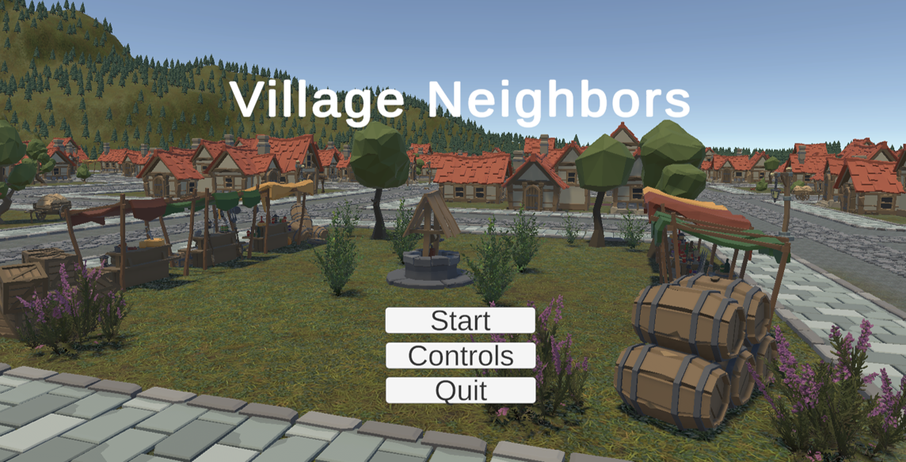
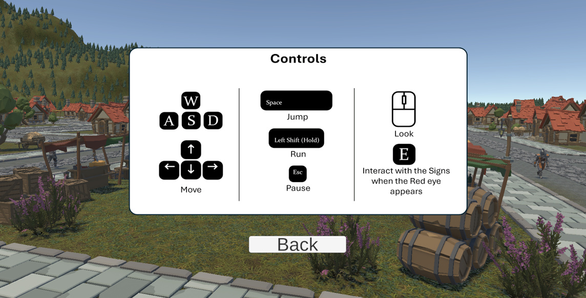
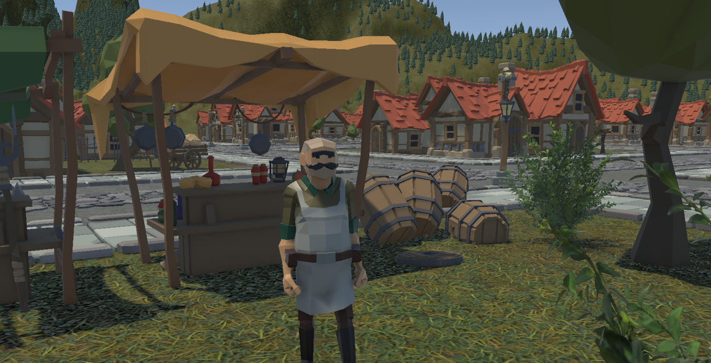
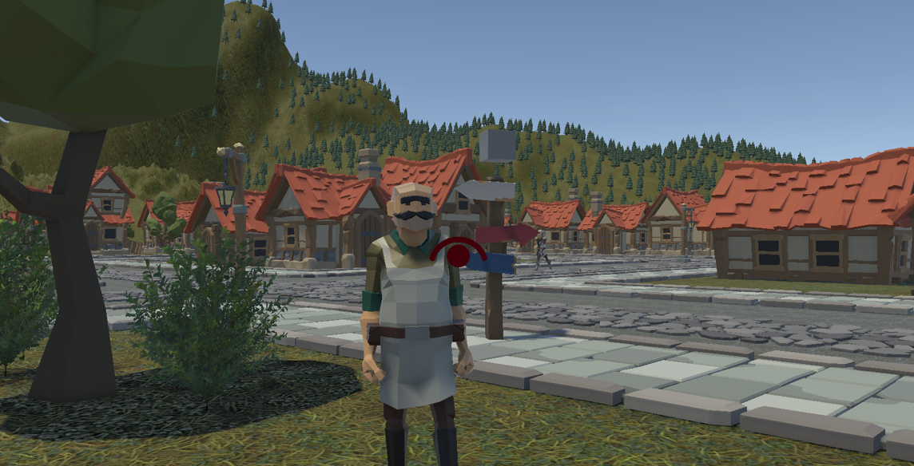
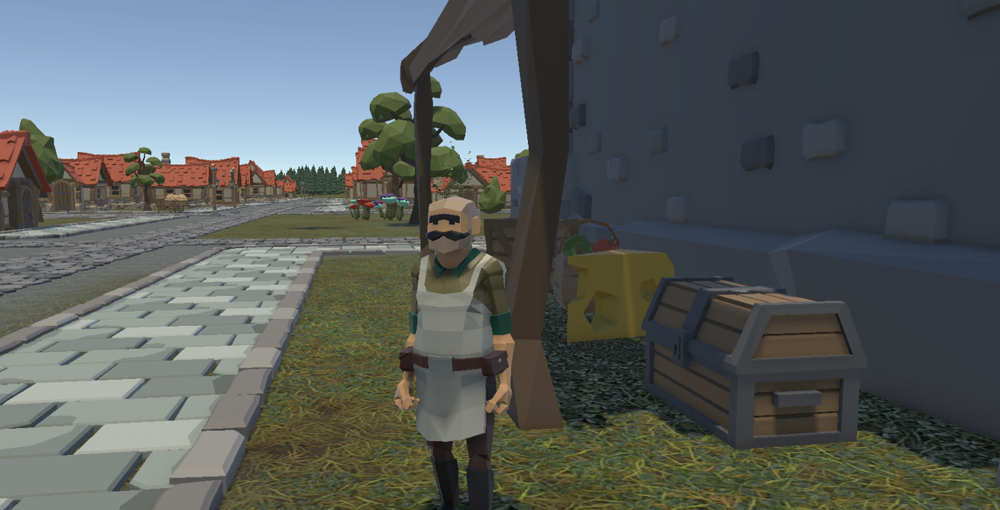
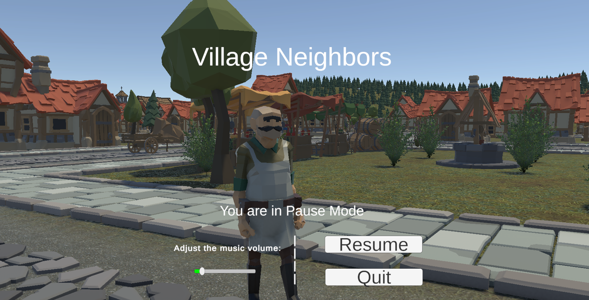

# 🕹️ Virtual Reality Game: Village Neighbors

**A low-poly VR adventure built with Unity and C#.**

> ℹ️ This project is not open source and does not grant any usage rights.
> For usage terms and legal information, see [Code Ownership & Usage Terms](#-code-ownership--usage-terms).

## 🧭 Overview

Village Neighbors is a simple virtual reality game developed in Unity using C#. The player explores a stylized village, interacts with objects and signs, and searches for a hidden treasure. The game includes animated elements, patrolling NPCs, and a pause menu with basic settings.

> 📌 The `resources` folder contains supporting material such as screenshots and documents.

## ✨ Highlights

- Immersive VR experience in a stylized village setting  
- Interactive clues and environmental storytelling  
- Smooth player controls and intuitive UI  
- Engaging animations and NPC behavior

## 🧩 Gameplay Features

- **Environmental Interaction**: Read signs and discover clues when prompted by visual cues.
- **Dynamic Animations**: Objects respond to player proximity.
- **Treasure Discovery**: Solve the mystery and unlock the final message.
- **NPC Patrolling**: Adds realism and movement to the village.
- **Pause Menu**: Adjust music volume, resume, or quit the game.

## 🎯 Purpose

This virtual reality game designed to immerse players in a stylized, low-poly village filled with secrets and interactive elements. The goal is to explore the environment, uncover clues, and ultimately discover a hidden treasure. The project showcases core VR development principles using Unity and C#, with a focus on environmental storytelling, interaction mechanics, and immersive design. **It is developed solely for academic and research purposes.**

## 📃 Presentation

You can view the full presentation of this project in PDF format here.

👉🏼 [Presentation (in greek)](resources/docs/VR_Game_Presentation_gr.pdf)

## 🧠 Scripts Used

Key C# scripts include:

- `MainMenu.cs`: Handles main menu logic  
- `PauseMenu.cs`: Controls pause functionality  
- `TriggerChest.cs`: Manages treasure chest activation  
- `NpcWalkingForward.cs`: Controls NPC movement  
- `IInteractable.cs`, `Interactor.cs`, `InteractorUI.cs`, `TextSign.cs`: Enable object interaction and feedback

## 🧰 Prerequisites

To run or modify the game, you’ll need:

- **Unity Editor 6000.0.27f1 LTS (recommended)** - Newer versions may work with minor adjustments
- **Visual Studio** with Unity development tools

## 📦 Installation

Follow these steps to set up and run the game:

1. **Clone the repository (or download and decompress the ZIP file)**
   ```bash
   git clone https://github.com/kpavlis/vr-game.git
   cd vr-game
   
2. **Import** the project folder in **Unity Hub** ("_Add project from disk_" selection)

3. **Launch** it with the appropriate Unity version

4. **Run** the game

## 📷 Screenshots / Video

**_App Screens:_**  

> 
> 
> 
> 
> 
> 


**_Demo Video:_**

> https://github.com/user-attachments/assets/1425762b-7976-4c44-b29d-f102b539205d

# 🔒 Code Ownership & Usage Terms

This project was created and maintained by:

- Konstantinos Pavlis (@kpavlis)
- Theofanis Tzoumakas (@theofanistzoumakas)
- Michael-Panagiotis Kapetanios (@KapetaniosMP)

🚫 **Unauthorized use is strictly prohibited.**  
No part of this codebase may be copied, reproduced, modified, distributed, or used in any form without **explicit written permission** from the owners.

Any attempt to use, republish, or incorporate this code into other projects—whether commercial or non-commercial—without prior consent may result in legal action.

For licensing inquiries or collaboration requests, please contact via email: konstantinos1125 _at_ gmail.com .

© 2025 Konstantinos Pavlis, Theofanis Tzoumakas, Michael-Panagiotis Kapetanios. All rights reserved.
